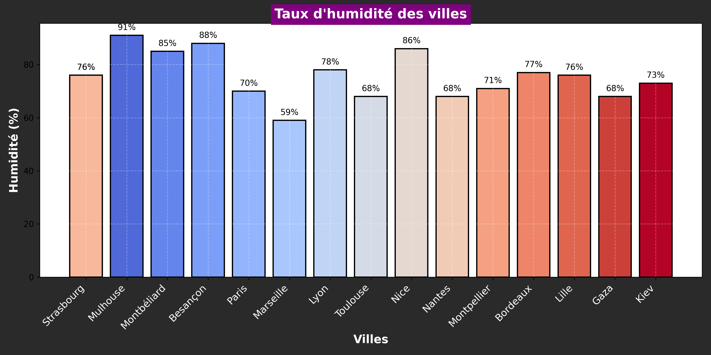

# Projet GitHub Actions avec Notifications, Scraping et Sécurité

Ce repo contient plusieurs workflows GitHub Actions :

1. **Scraping & Reporting** : Un script Python qui scrute un site web pour récupérer des informations (comme les titres des articles) et met à jour un fichier JSON.
2. **Envoi de Notifications** : Notifie via Telegram ou Discord lorsqu'une PR est créée ou un commit est poussé.
3. **Monitoring & Sécurité** : Vérifie les dépendances du projet pour détecter des vulnérabilités de sécurité en utilisant pip-audit.

## Usage

1. Configurez votre bot Telegram pour envoyer des notifications.
2. Modifiez le script de scraping pour qu'il récupère les données pertinentes du site que vous souhaitez surveiller.
3. Exécutez les workflows GitHub Actions pour les vérifications de sécurité.

## Météo actuelle :
## Météo des grandes villes + Gaza et Kiev 🌍

🕒 Mise à jour : 18/03/2025 07:47:09

### 🌍 Strasbourg ☀️
**Conditions :** ciel dégagé
**Température :** 1.01°C
**Humidité :** 60%
**Vent :** 4.12 m/s

### 🌍 Mulhouse 🌥️
**Conditions :** peu nuageux
**Température :** 0.14°C
**Humidité :** 72%
**Vent :** 2.06 m/s

### 🌍 Montbéliard ☀️
**Conditions :** ciel dégagé
**Température :** 1.1°C
**Humidité :** 72%
**Vent :** 5.94 m/s

### 🌍 Besançon ☀️
**Conditions :** ciel dégagé
**Température :** 0.56°C
**Humidité :** 74%
**Vent :** 1.52 m/s

### 🌍 Paris ☀️
**Conditions :** ciel dégagé
**Température :** 2.32°C
**Humidité :** 63%
**Vent :** 5.66 m/s

### 🌍 Marseille ☀️
**Conditions :** ciel dégagé
**Température :** 5.61°C
**Humidité :** 87%
**Vent :** 3.38 m/s

### 🌍 Lyon ☀️
**Conditions :** ciel dégagé
**Température :** -1.15°C
**Humidité :** 91%
**Vent :** 0.83 m/s

### 🌍 Toulouse ☀️
**Conditions :** ciel dégagé
**Température :** 6.99°C
**Humidité :** 76%
**Vent :** 6.17 m/s

### 🌍 Nice 🌥️
**Conditions :** peu nuageux
**Température :** 3.61°C
**Humidité :** 78%
**Vent :** 1.58 m/s

### 🌍 Nantes ☀️
**Conditions :** ciel dégagé
**Température :** 3.96°C
**Humidité :** 81%
**Vent :** 5.14 m/s

### 🌍 Strasbourg ☀️
**Conditions :** ciel dégagé
**Température :** 1.01°C
**Humidité :** 60%
**Vent :** 4.12 m/s

### 🌍 Montpellier 🌥️
**Conditions :** nuageux
**Température :** 6.94°C
**Humidité :** 76%
**Vent :** 3.09 m/s

### 🌍 Bordeaux ☀️
**Conditions :** ciel dégagé
**Température :** 5.15°C
**Humidité :** 70%
**Vent :** 2.57 m/s

### 🌍 Lille ☀️
**Conditions :** ciel dégagé
**Température :** 0.22°C
**Humidité :** 59%
**Vent :** 4.12 m/s

### 🌍 Gaza 🌥️
**Conditions :** peu nuageux
**Température :** 22.33°C
**Humidité :** 58%
**Vent :** 3.39 m/s

### 🌍 Kiev ☀️
**Conditions :** ciel dégagé
**Température :** -0.71°C
**Humidité :** 59%
**Vent :** 0.89 m/s

### 🌡️ Graphique d'humidité des villes

## Météo actuelle
✅ Météo mise à jour avec succès.
